## noomi-rpc 框架的整体架构

### noomi-rpc的各个模块
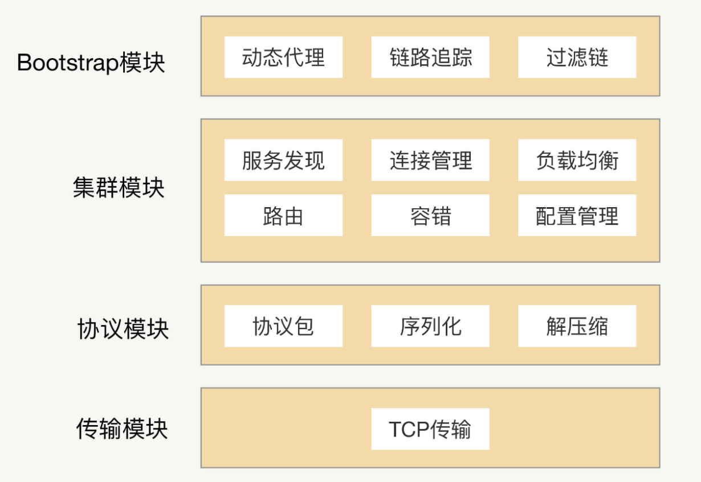

### 基础架构


### 详细架构
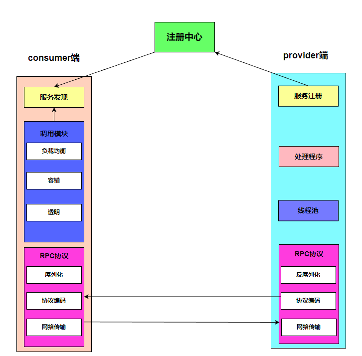

### noomi-rpc框架的通信流程
rpc能实现调用远程方法就跟调用本地（同一个项目中的方法）一样，发起调用请求的那一方叫做调用方，被调用的一方叫做服务提供方。

发起远程调用的核心是网络通信，noomi-rpc框架的核心就是封装通信细节：

1、传输协议：既然noomi-rpc存在的核心目的是为了实现远程调用，既然是远程调用那肯定就需要通过网络来传输数据，并且noomi-rpc常用于业务系统之间的数据交互，需要保证其可靠性，所以 noomi-rpc 一般默认采用 TCP 来传输。事实上，HTTP 协议也是建立在 TCP 之上的。选择tcp的核心原因还是因为他的效率要比很多应用层协议高很多。

2、封装一个可用的协议：选择了合适的传输层协议之后，我们需要基于此建立一个我们自己的通用协议，和http一样需要封装自己的应用层协议，暂时命名为noomi协议。

3、序列化：网络传输的数据必须是二进制数据，但调用方请求的出入参数都是对象。对象是肯定没法直接在网络中传输的，需要提前把它转成可传输的二进制，并且要求转换算法是可逆的。

4、压缩：如果我们觉得序列化后的字节数组体积比较大，我们还可以对他进行压缩，压缩后的字节数组体积更小，能在传输的过程中更加节省带宽和内存。

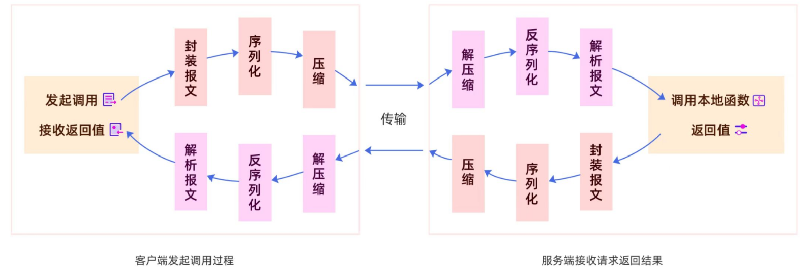

对于研发人员来说，上面的方式要掌握太多的 rpc 底层细节，需要手动写代码去构造请求、调用序列化，并进行网络调用，整个 API 非常不友好。

因此需要简化 API，屏蔽掉 rpc 细节，让使用方只需要关注业务接口，像调用本地一样来调用远程。

解决方式就是使用AOP技术，其核心是采用动态代理的技术，通过字节码增强对方法进行拦截增强，以便于增加需要的额外处理逻辑。 由服务提供者给出业务接口声明，在调用方的程序里面，rpc 框架根据调用的服务接口提前生成动态代理实现类，并通过依赖注入等技术注入到声明了该接口的相关业务逻辑里面。该代理实现类会拦截所有的方法调用，在提供的方法处理逻辑里面完成一整套的远程调用，并把远程调用结果返回给调用方，这样调用方在调用远程方法的时候就获得了像调用本地接口一样的体验。

### 框架设计
#### 1. 服务注册与发现 - 基于zookeeper的服务发现
搭建一个 ZooKeeper 集群作为注册中心，服务注册的时候只需要服务节点向 ZooKeeper 节点写入注册信息即可，利用 ZooKeeper 的 Watcher 机制完成服务订阅与服务下发功能，整体流程如下图：

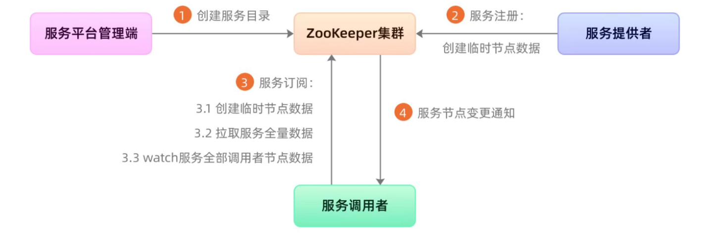

1. 服务平台管理端先在 ZooKeeper 中创建一个服务根路径，可以根据接口名命名：

2. 在这个路径再创建服务提供方目录与服务调用方目录

3. 当服务提供方发起注册时，会在服务提供方目录中创建一个临时节点，节点中存储该服务提供方的注册信息。

4. 当服务调用方发起订阅时，则在服务调用方目录中创建一个临时节点，节点中存储该服务调用方的信息，同时服务调用方 watch 该服务的服务提供方目录中所有的服务节点数据。

5. 当服务提供方目录下有节点数据发生变更时，ZooKeeper 就会通知给发起订阅的服务调用方。

#### 2. consumer和provider端之间的连接
原理图如下：

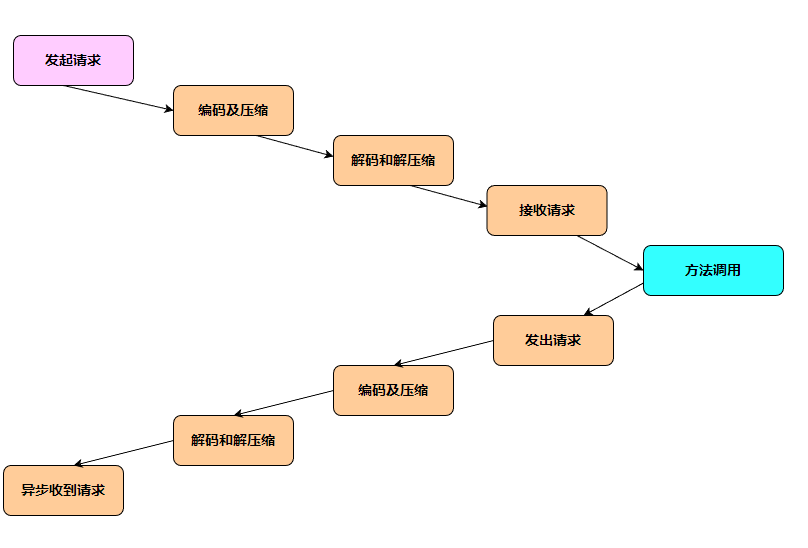

#### 3. 协议制定-封装报文
相对于 HTTP 的而言，rpc 更多的是负责应用间的通信，所以性能要求相对更高。但 HTTP 协议的数据包大小相对请求数据本身要大很多，又需要加入很多无用的内容，比如换行符号、回车符等；还有一个更重要的原因是，HTTP 协议属于无状态协议，客户端无法对请求和响应进行关联，每次请求都需要重新建立连接，响应完成后再关闭连接。因此，对于要求高性能的 rpc 来说，HTTP 协议基本很难满足需求，所以 rpc 会选择设计更紧凑的私有协议。

在设计一个 rpc（Remote Procedure Call）远程调用框架时，需要考虑如何对请求和响应数据进行封装、以及编码、解码，以及如何表示调用的方法和参数。此时，我们必须要设计一个私有且通用的私有协议，协议是一种公平对话的模式，有了标准协议调用方和服务提供方就可以互相按照标准进行协商。

协议结构如下：
```text
+-----------------------------------------------+
|                    Header                     |
+-----------------------------------------------+
|                      Body                     |
+-----------------------------------------------+
```
Header结构如下：
Header 可以包含以下字段：
- Magic Number（4 字节）：魔数，用于识别该协议，例如：0xCAFEBABE。
- Version（1 字节）：协议版本号。
- MessageType（1 字节）：消息类型，例如：0x01 表示请求，0x02 表示响应。
- Serialization Type（1 字节）：序列化类型，例如：0x01 表示 JSON，0x02 表示 Protobuf 等。
- Request ID（8 字节）：请求ID，用于标识请求和响应的匹配。
- Body Length（4 字节）：Body 部分的长度。
- head length(4 字节)

Body结构：
Body 的结构取决于具体的 noomi-rpc 请求或响应数据。

对于 noomi-rpc 请求，Body 可以包含以下字段：
- Service Name：被调用的服务名称。
- Method Name：被调用的方法名称。
- Method Arguments：被调用方法的参数列表。
- Method Argument Types：被调用方法参数的类型列表。

对于 noomi-rpc 响应，Body 可以包含以下字段：
- Status Code：响应状态码，例如：0x00 表示成功，0x01 表示失败。
- Error Message：错误信息，当 Status Code 为失败时，包含具体的错误信息。
- Return Value：方法返回值，当 Status Code 为成功时，包含方法调用的返回值。

报文格式如下：

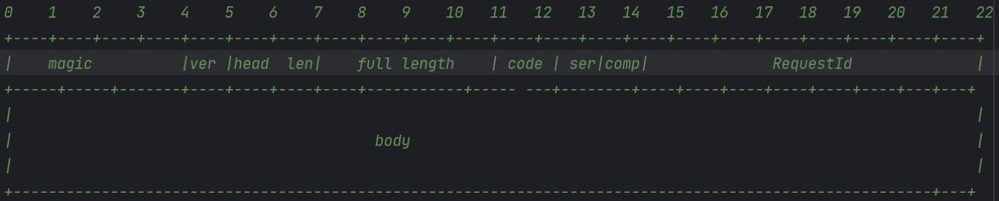

#### 4. 协议制定-对象序列化

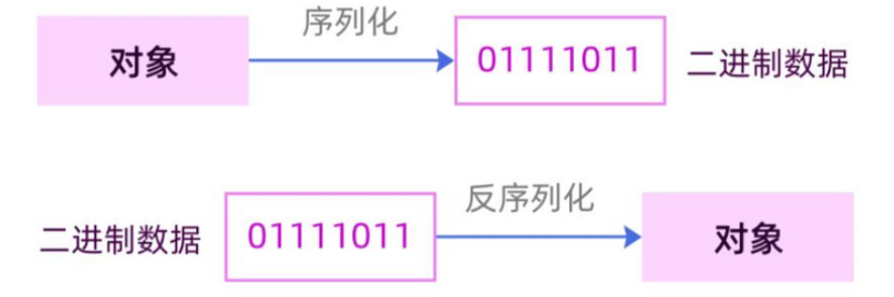

网络传输中，我们不能直接将内存的对象实例直接进行传输，而是需要将其序列化成一组二进制数据，这样的二进制数据可以是字符序列，如：
1. json
2. protobuf
3. 其他的如流
事实上会发现一个问题，不同的序列化方式，在序列化后的信息密度是不一样的，像json这样，可以轻易读懂，也就意味着他的信息密度是最小的，也就是序列化后的体积是最大的，传输传输过程中需要的带宽也是最大的，因此选用什么样的序列化方式，要和系统的特性相结合。当然为了让noomi-rpc框架更加的灵活和具备可扩展性，可以灵活配置序列化方式。

#### 5. 协议制定-二进制压缩
如果序列化后的二进制内容体积仍然比较大，仍然不能支持当前的业务容量，可以选择对序列化的结果进行压缩，但是这个操作本是就是一个cpu资源换取存储和带宽资源的操作，要考虑当前的业务是更需要cpu资源还是内存资源。

压缩的方式通常是gzip

#### 6. 生成请求的唯一标识
在当前项目中，需要给请求一个唯一标识，用来标识一个请求和响应的关联关系，要求请求的id必须唯一，且不能占用过大的空间，可用的方案如下：

1. 自增id，单机的自增id不能解决不重复的问题，微服务情况下我们需要一个稳定的发号服务才能保证，但是这样做性能偏低。

2. uuid，将uuid作为唯一标识占用空间太大

3. 雪花算法，最优解。

雪花算法(snowflake)最早是twitter内部使用分布式环境下的唯一ID生成算法，他使用64位long类型的数据存储id，具体如下：

```text
0 - 0000000000 0000000000 0000000000 0000000000 0 - 0000000000 - 000000000000
符号位 时间戳 机器码 序列号
```
最高位表示符号位，其中0代表整数，1代表负数，而id一般都是正数，所以最高位为0。

41位存储毫秒级时间戳，这个时间戳不是存储当前时间的时间戳，而是存储时间戳的差值（当前时间戳 - 开始时间戳) * 得到的值），这样可以存储一个相对更长的时间。

10位存储机器码，最多支持1024台机器，当并发量非常高，同时有多个请求在同一毫秒到达，可以根据机器码进行第二次生成。机器码可以根据实际需求进行二次划分，比如两个机房操作可以一个机房分配5位机器码。

12位存储序列号，当同一毫秒有多个请求访问到了同一台机器后，此时序列号就派上了用场，为这些请求进行第三次创建，最多每毫秒每台机器产生2的12次方也就是4096个id，满足了大部分场景的需求。

总的来说雪花算法有以下几个优点：

能满足高并发分布式系统环境下ID不重复
基于时间戳，可以保证基本有序递增
不依赖第三方的库或者中间件
生成效率极高

但是有一个致命缺点：及其依赖时间戳，因为怕服务器的时间回溯，这样可能生成的id不唯一。

#### 7. 负载均衡
consumer端拉去服务列表后需要选择一个节点通信，那么选择的方式就通过负载均衡算法，目前的rpc框架基本都是用一致性hash算法。

传统的hash算法的弊端，如下图：

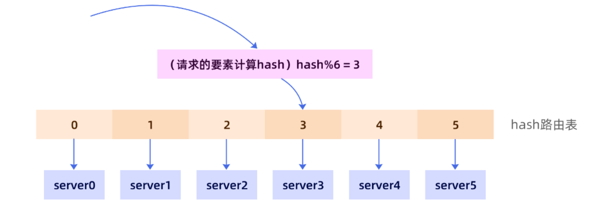

但是，这样的方式会存在很多问题，如动态扩容的问题。比如，随着业务量增长，将原有的六个服务扩容至八个，此时，我们不仅要修改路由表，还要修改hash的路由策略。

一致性hash算法的设计原理如下：
1. 将hash值均匀的分布在一个区间，我们一般将区间设置为整形的取值范围（-231 ~ 231-1）当然这个范围也可以是（0 ~ 232-1），只要是一个合理的容易计算的足够大的范围即可。

2. 将这个区间构建成一个环，构建成环不一定必须要链表，其实很多的有序的数据结构都可以，比如数组，比如红黑树，只要加上一点点逻辑，就是数完最后一个回到第一个节点就可以了。

3. 将服务器按照自身的特点，计算hash值，并将其挂载在hash表中。

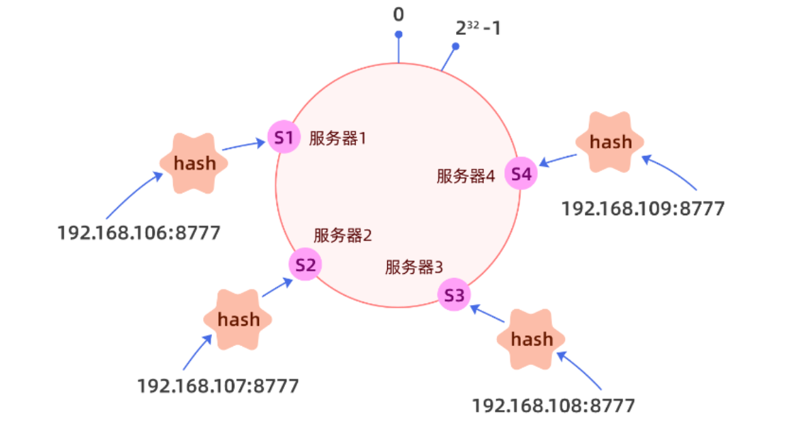

当请求进来以后，根据请求的部分特征，如url、请求id，请求来源等信息进行hash运算，看请求落在哪个范围，然后顺时针找到第一个服务器即可，这样最大的好处就是当有新的服务加入集群只需要将服务挂载在hash环即可，但是后自然会有流量进入该服务器，而不需要修改任何的逻辑，因为我们的hash环足够大，所以可以容纳的机器也很多。

但是此时会出现一个问题，如果节点过少，hash分布不均匀会产生严重的流量倾斜：

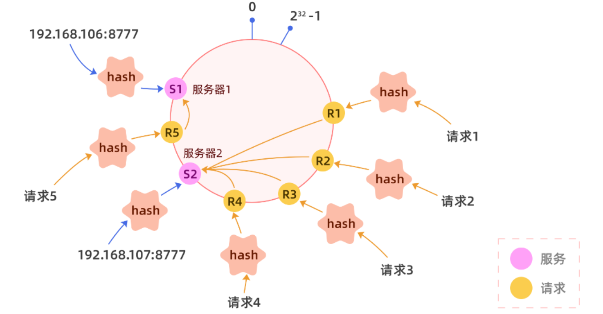

为了解决这个问题，就需要引入虚拟节点的概念，可以将一个真实节点化身为n个（比如128）虚拟节点，每个虚拟节点都指向同一个服务，分别对虚拟节点进行hash，可以让一个服务的虚拟节点大致均匀的分布在hash环上。当然虚拟节点数也可以乘以每个服务单位权重。

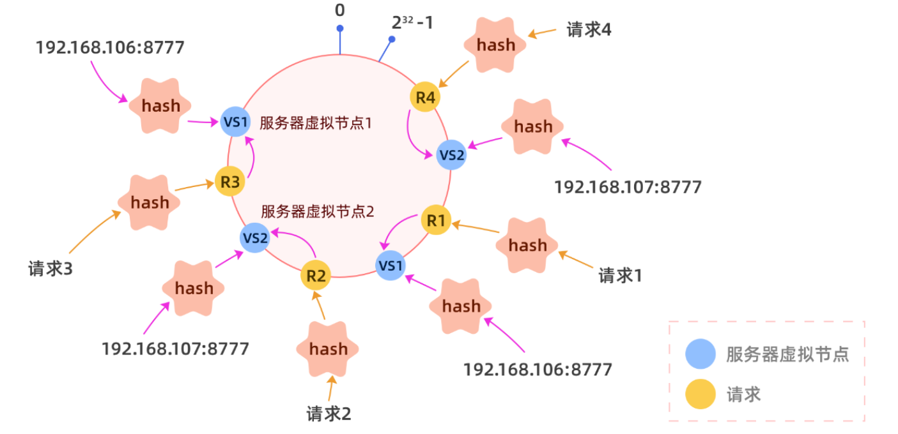

#### 8. 心跳检测

前面consumer端和provider端已经建立的一个长连接，这是一个channel，我们需要自动感知channel的连接状态，实现探活。

心跳检测的核心原理就是定期向所有的channel发送一个简单的请求即可，如果能得到回应说明连接是正常的。

其中要在心跳探测的过程中完成以下几项工作：

1、如果可以正常访问，记录响应时间，以备后用。

2、如果不能正常访问，则进行重试，重试三次依旧不能访问，则从健康服务列表中剔除，以后的访问不会使用该连接。

注意：重试的等待时间我们选取一个合适范围内的随机时间，这样可以避免局域网络问题导致的大面积同时重试，产生重试风暴。

心跳检测可以帮助我们收集一些元数据（比如响应时间），我们也可以将响应时间和对应的channel进行排序，取出响应时间最短的即可。

#### 9. 动态上下线
当有服务提供方动态上下线，此时我们需要去进行感知的。服务上线，首先会在注册中心进行注册，调用方是无法实时感知的，合理的方式只有两种：

1、调用方定时的去主动的拉。

2、注册中心主动的推送。

zookeeper中提供了watcher机制，可以利用他来实现动态上下线，具体步骤如下：

1、调用方拉取服务列表时，注册一个watcher关注该服务节点的变化。

2、当服务提供方上线或线下时会触发watcher机制（节点发生了变化）。

3、通知调用方，执行动态上下线的操作。

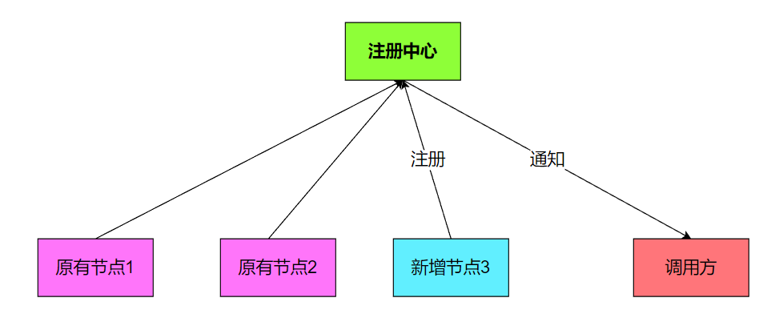

#### 10. 包扫描发布
扫描文件夹，进行批量发布，具体步骤如下：

1. 首先需要定义一个装饰器@Service()，装饰在需要发布的服务上。

2. 遍历文件夹下的所有ts文件。

3. 将@Service装饰的方法封装成ServiceConfig对象，调用发布接口进行发布即可。

#### 11. 异常重试
1、为什么需要异常重试？

可以考虑这样一个场景。发起一次 noomi-rpc 调用，去调用远程的一个服务，比如用户的登录操作，我们会先对用户的用户名以及密码进行验证，验证成功之后会获取用户的基本信息。当我们通过远程的用户服务来获取用户基本信息的时候，恰好网络出现了问题，比如网络突然抖了一下，导致我们的请求失败了，而这个请求我们希望它能够尽可能地执行成功，那这时我们要怎么做呢？

我们需要重新发起一次 noomi-rpc 调用，如果是在代码逻辑里 catch 一下，失败了就再发起一次调用，这样做显然不够优雅。这时可以考虑使用 noomi-rpc 框架的重试机制。

因此当调用端发起的请求失败时，noomi-rpc 框架自身可以进行重试，再重新发送请求，用户可以自行设置是否开启重试以及重试的次数。

方案如下：
1. 手动指定可重试的接口，可以通过注解的形式进行标记，有特定注解的接口才能重试。

2. 设置重试白名单。

但是有个问题，如果因为机房的网络问题导致了大量的请求被重试，而且是同时进行，会产生问题。

为了避免因网络抖动导致的重试风暴，可以采用以下策略：
1. 指数退避算法：在连续的重试中，每次重试之间的等待时间呈指数级增长。这样可以降低在短时间内发起大量重试请求的可能性，从而减轻对系统的压力。
2. 随机抖动：在指数退避算法的基础上，引入随机抖动，使得重试之间的等待时间变得不那么规律。这样可以避免多个客户端在相同时间点发起重试请求，进一步减轻服务器压力。
3. 限制重试次数和超时时间：限制单个请求的最大重试次数，以及整个重试过程的总超时时间，防止无限制地发起重试请求。
4. 请求结果缓存：如果有些请求的结果可以缓存，可以考虑在客户端或服务器端缓存请求结果。当发生重试时，直接从缓存中获取结果，以减轻服务器压力。
5. 服务熔断：在客户端或服务器端实现熔断机制，当连续失败达到一定阈值时，触发熔断，暂时阻止后续请求。熔断器在一段时间后会自动恢复，允许新的请求通过。

#### 12. 服务端限流
当要发布一个 noomi-rpc 服务，作为服务端接收调用端发送过来的请求，这时服务端的某个节点负载压力过高了，我们需要保护这个节点。

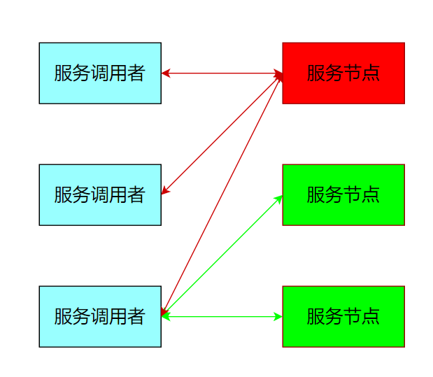

我们可以在 noomi-rpc 框架中集成限流的功能，让使用方自己去配置限流阈值；我们还可以在服务端添加限流逻辑，当调用端发送请求过来时，服务端在执行业务逻辑之前先执行限流逻辑，如果发现访问量过大并且超出了限流的阈值，就让服务端直接抛回给调用端一个限流异常，否则就执行正常的业务逻辑。

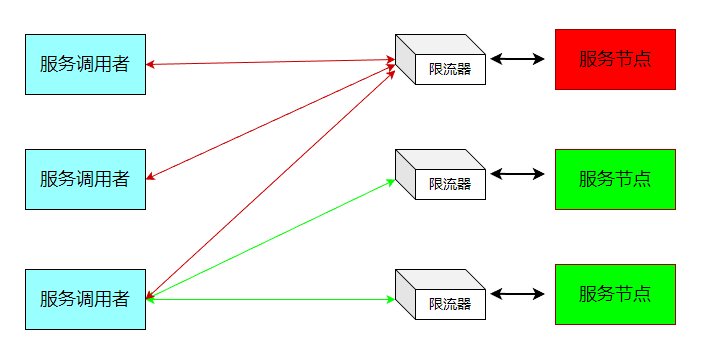

限流方式有很多，比如最简单的计数器，还有可以做到平滑限流的滑动窗口、漏斗算法以及令牌桶算法等等。其中令牌桶算法最为常用。

我们可以假设这样一个场景：我发布了一个服务，提供给多个应用的调用方去调用，这时有一个应用的调用方发送过来的请求流量要比其它的应用大很多，这时我们就应该对这个应用下的调用端发送过来的请求流量进行限流。所以说我们在做限流的时候要考虑应用级别的维度，甚至是 IP 级别的维度，这样做不仅可以让我们对一个应用下的调用端发送过来的请求流量做限流，还可以对一个 IP 发送过来的请求流量做限流。

我们可以通过 noomi-rpc 治理的管理端进行配置，再通过注册中心或者配置中心将限流阈值的配置下发到服务提供方的每个节点上，实现动态配置。在服务端实现限流，配置的限流阈值是作用在每个服务节点上的。

看这样一个场景：我提供了一个服务，而这个服务的业务逻辑依赖的是 MySQL 数据库，由于 MySQL 数据库的性能限制，我们是需要对其进行保护。假如在 MySQL 处理业务逻辑中，SQL 语句的能力是每秒 10000 次，那么我们提供的服务处理的访问量就不能超过每秒 10000 次，而我们的服务有 10 个节点，这时我们配置的限流阈值应该是每秒 1000 次。那如果之后因为某种需求我们对这个服务扩容了呢？扩容到 20 个节点，我们是不是就要把限流阈值调整到每秒 500 次呢？这样操作每次都要自己去计算，重新配置，显然太麻烦了。

我们可以让 noomi-rpc 框架自己去计算，当注册中心或配置中心将限流阈值配置下发的时候，我们可以将总服务节点数也下发给服务节点，之后由服务节点自己计算限流阈值。

还有一个问题存在，那就是在实际情况下，一个服务节点所接收到的访问量并不是绝对均匀的，比如有 20 个节点，而每个节点限流的阈值是 500，其中有的节点访问量已经达到阈值了，但有的节点可能在这一秒内的访问量是 450，这时调用端发送过来的总调用量还没有达到 10000 次，但可能也会被限流。

我们可以提供一个专门的限流服务，让每个节点都依赖一个限流服务，当请求流量打过来时，服务节点触发限流逻辑，调用这个限流服务来判断是否到达了限流阈值。我们甚至可以将限流逻辑放在调用端，调用端在发出请求时先触发限流逻辑，调用限流服务，如果请求量已经到达了限流阈值，请求都不需要发出去，直接返回给动态代理一个限流异常即可。

这种限流方式可以让整个服务集群的限流变得更加精确，但也由于依赖了一个限流服务，它在性能和耗时上与单机的限流方式相比是有很大劣势的。因此需要结合具体的应用场景进行选择。

#### 13. 调用端的熔断
举个例子，假如我要发布一个服务 B，而服务 B 又依赖服务 C，当一个服务 A 来调用服务 B 时，服务 B 的业务逻辑调用服务 C，而这时服务 C 响应超时了，由于服务 B 依赖服务 C，C 超时直接导致 B 的业务逻辑一直等待，而这个时候服务 A 在频繁地调用服务 B，服务 B 就可能会因为堆积大量的请求而导致服务宕机。


由此可见，服务 B 调用服务 C，服务 C 执行业务逻辑出现异常时，会影响到服务 B，甚至可能会引起服务 B 宕机。在整个调用链中，只要中间有一个服务出现问题，都可能会引起上游的所有服务出现一系列的问题，甚至会引起整个调用链的服务都宕机，这是非常恐怖的。

因此，在一个服务作为调用端调用另外一个服务时，为了防止被调用的服务出现问题而影响到作为调用端的这个服务，这个服务也需要进行自我保护。而最有效的自我保护方式就是熔断。

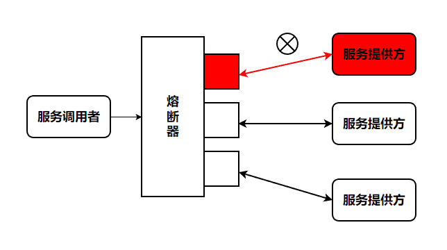

熔断机制原理：

熔断器的工作机制主要是关闭、打开和半打开这三个状态之间的切换。

1. 在正常情况下，熔断器是关闭的。
2. 当调用端调用下游服务出现异常时，熔断器会收集异常指标信息进行计算，当达到熔断条件时熔断器打开，这时调用端再发起请求是会直接被熔断器拦截，并快速地执行失败逻辑；
3. 当熔断器打开一段时间后，会转为半打开状态，这时熔断器允许调用端发送一个请求给服务端，如果这次请求能够正常地得到服务端的响应，则将状态置为关闭状态，否则设置为打开。

熔断机制主要是保护调用端，调用端在发出请求的时候会先经过熔断器。因此需要在动态代理中加入熔断逻辑。 因为在 noomi-rpc 调用的流程中，动态代理是 noomi-rpc 调用的第一个关口。在发出请求时先经过熔断器，如果状态是闭合则正常发出请求，如果状态是打开则执行熔断器的失败策略。

#### 14. 流量隔离
在业务量不大的情况下，应用之间的调用关系并不会复杂，请求量也不会很大，应用有足够的能力扛住日常的所有流量。并不需要花太多的时间去治理调用请求过来的流量，因此通常会选择最简单的方法，就是把服务实例统一管理，把所有的请求都用一个共享的“大池子”来处理。服务调用方跟服务提供方之间的调用拓扑如下图所示：

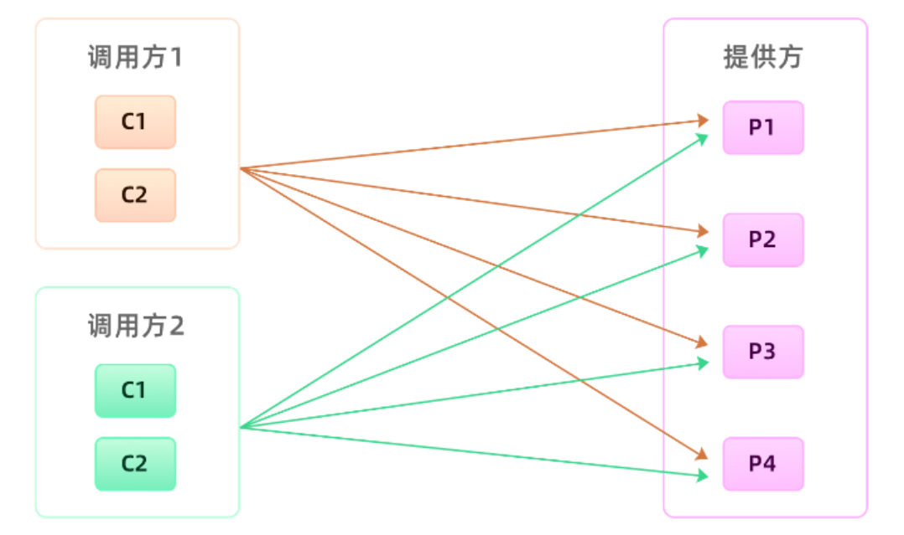

但是为了杜绝高流量的情况，最好的办法就是隔离流量，将多个noomi-rpc服务进行分组，一个调用方只能访问一个分组的服务，就是一个调用方流量爆炸也只会影响一个分组的服务，整体还是可用的。

分组实现的原理：

分组的逻辑的就是让调用方可以发现一个分组的服务，那实现的逻辑就一定是服务发现的时候只能拉取同一个分组的服务。因此调用方去获取服务节点的时候除了要带着接口名，还需要另外加一个分组参数，相应的服务提供方在注册的时候也要带上分组参数。

标准应该是非核心应用不要跟核心应用分在同一个组，核心应用之间应该做好隔离，一个重要的原则就是保障核心应用不受影响。比如提供给电商下单过程中用的商品信息接口，我们肯定是需要独立出一个单独分组，避免受其它调用方污染的。有了分组之后，我们的服务调用方跟服务提供方之间的调用拓扑就如下图所示：


#### 15.优雅停机

考虑这样一个问题：当启动了多个服务提供方，同时启动了服务调用方，不断的进行方法调用，然后快速关闭几个提供方可能会出现问题，因为当快速关闭服务提供方时，注册中心感知、以及通过watcher机制通知调用方一定不能做到实时，一定会有延时，同时我们的心跳检测也会有一定的时间间隔。也就意味着当一个提供方实际上已经下线了，但是他依然在调用方的健康列表中，调用方依然认为他健康依然会给他发送消息，最后的结果就是超时等待，不断重试而已。所以如何在服务下线时快速的让调用方感知，很重要。

目前rpc的解决方案：

1、通过控制台人工通知调用方，让他们手动摘除要下线的机器，这种方式很原始也很直接。但这样对于提供方上线的过程来说太繁琐了，每次上线都要通知到所有调用我接口的团队，整个过程既浪费时间又没有意义，显然不能被正常接受。

2、通过服务发现机制感知，这种方式我们探讨过，因为存在一定的时间差，所以会出现一定的问题。

3、不强依赖“服务发现”来通知调用方要下线的机器，由服务提供方自己来通知行不行。在noomi-rpc里面调用方跟服务提供方之间是长连接，我们可以在提供方应用内存里面维护一份调用方连接集合，当服务要关闭的时候，挨个去通知调用方去下线这台机器。

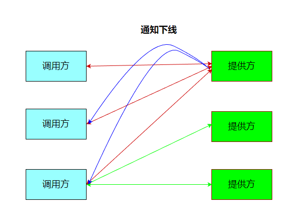

但是第三种方案也有一定的问题：如请求的时间点跟收到服务提供方关闭通知的时间点很接近，只比关闭通知的时间早不到1ms，如果再加上网络传输时间的话，那服务提供方收到请求的时候，它应该正在处理关闭逻辑。这就说明服务提供方关闭的时候，并没有正确处理关闭后接收到的新请求。

因此我们可以在关闭的时候，设置一个请求”挡板”，挡板的作用就是告诉调用方，我已经开始进入关闭流程了，我不能再处理你这个请求了。

改进的思路如下：

1. 调用方发起请求，给调用方一个特殊的响应，使用响应码标记即可，就是告诉调用方我已经收到这个请求了，但是我正在关闭，并没有处理这个请求。 
2. 调用方收到这个异常响应后，noomi-rpc框架把这个节点从健康列表挪出，并把请求自动重试到其他节点，因为这个请求是没有被服务提供方处理过，所以可以安全地重试至其他节点，这样就可以实现对业务无损。

但是还有一个问题：关闭过程中已经在处理的请求会受到影响

解决方案如下：

如果进程结束过快会造成这些请求还没有来得及应答， 此时调用方会也会抛出异常。为了尽可能地完成正在处理的请求，首先我们要把这些请求识别出来，需要有一个标识来判断是否还有正在处理的请求，如果没有了再关闭服务。

引入一个全局计数器，每开始处理请求之前加一完成请求处理减一，通过该计数器我们就可以快速判断是否有正在理的请求。

服务对象在关闭过程中，会拒绝新的请求，同时根据引用计数器等待正在处理的请求全部结束之后才会真正关闭。但考虑到有些业务请求可能处理时间长，或者存在被挂住的情况，为了避免一直等待造成应用无法正常退出，我们可以在整个 ShutdownHook里面，加上超时时间控制，当超过了指定时间没有结束，则强制退出应用。整个流程如下图所示。

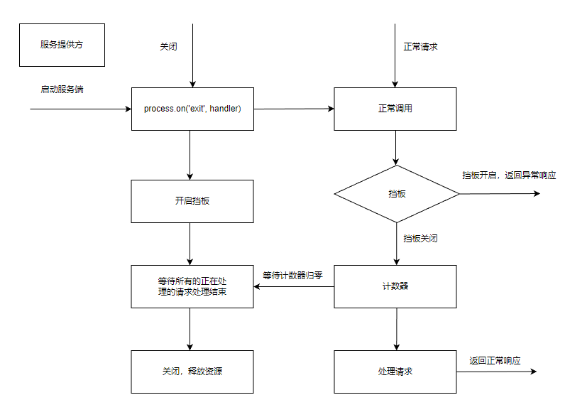

#### 16. 优雅启动

首先启动预热，让刚启动的服务提供方应用不承担全部的流量，而是让它被调用的次数随着时间的移动慢慢增加，最终让流量缓和地增加到跟已经运行一段时间后的水平一样。

实现方案：

我们可以让负载均衡在选择连接的时候，区分一下是否是刚启动不久的应用，对于刚启动的应用，我们可以让它被选择到的概率特别低，但这个概率会随着时间的推移慢慢变大，从而实现一个动态增加流量的过程。

其次延迟暴露，因为我们在启动过程中就把解析到的noomi-rpc服务注册到了注册中心，导致在后续加载没有完成的情况下服务提供方的地址就被服务调用方感知到了。

我们需要利用服务提供方把接口注册到注册中心的那段时间。我们可以在服务提供方应用启动后，接口注册到注册中心前，预留一个 Hook 过程，让用户可以实现可扩展的 Hook 逻辑。用户可以在 Hook 里面模拟调用逻辑，从而使 v8 指令能够预热起来，并且用户也可以在 Hook 里面事先预加载一些资源，只有等所有的资源都加载完成后，最后才把接口注册到注册中心。
